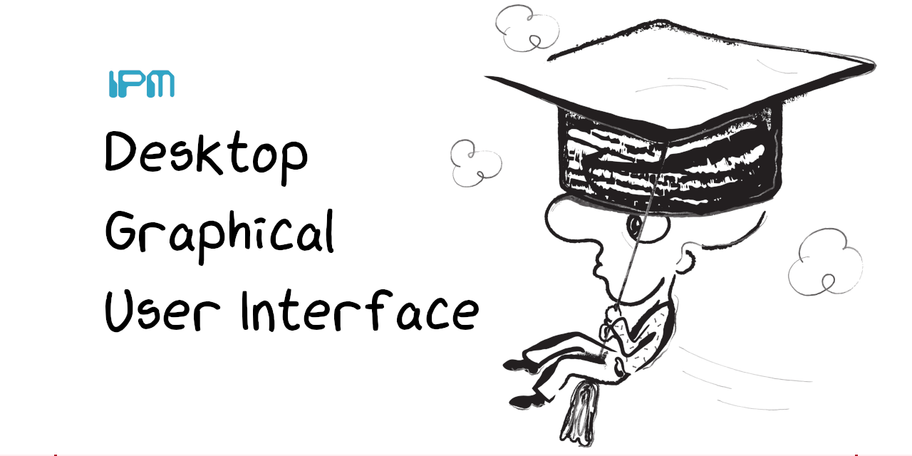

# Curso 23/24. Práctica 1. Interfaces gráficas para aplicaciones de escritorio

_Repositorio dedicado al desarrollo de la primera práctica de equipo
de IPM_

La práctica consiste en el desarrollo de una aplicación de escritorio
con su _interface gráfica_.

Este repositorio contiene:

  - Un documento que describe los _roles_ a desempeñar en el desarrollo
    de la práctica.
    
  - Un enunciado que describe el trabajo a realizar en el desarrollo
    de la práctica.
    
  - Un conjunto de rúbricas válidas tanto para la evaluación como para
    la autoevaluación del trabajo realizado.

## Miembros del equipo:

- Rodríguez Rodríguez, Javier : Javier-r-r : j.rrodriguez1 : Analista
- Dopazo García, Diego : DiegoDopazoGarcia : diego.dopazo.garcia : Rol de Curador-Traductor
- Mosquera Dapena, Manuel : manu8uu : m.mosquera1 : Facilitador-Administrador

## Pasos para realizar la práctica

1. -[x] Si estás leyendo este _README_ es porque has creado el repositorio
   correspondiente desde el enlace de _github classroom_. Asegurate de
   ello.
   	 
3. -[x] Asignar los roles a cada miembro del equipo. La información
   relativa a los roles se ecuentra en el fichero [roles.md](roles.md).
   
4. -[x] Cubrir el apartado "Miembros del equipo" siguiendo el formato
   establecido.
   
5. -[x] Leer y comprender el enunciado de la práctica, disponible en el
   fichero [enunciado.md](enunciado.md).

6. -[x] Leer y comprender las rúbricas disponibles en el fichero
   [rubricas.md](rubricas.md).

7. -[x] Planificar y coordinar el trabajo entre los miembros del equipo.

6. -[x] Realizar la tarea 1.

8. -[x] Presentar la tarea 1 y realizar las correcciones indicadas.

9. -[x] Realizar la tarea 2.

10. -[x] Presentar la tarea 2 y realizar las correcciones indicadas.

11. -[x] Realizar la tarea 3.

12. -[ ] Presentar la tarea 3 y realizar las correcciones indicadas.

13. -[x] Revisar el contenido del repositorio en github.

14. -[ ] Presentar la práctica ya finializada.
 
