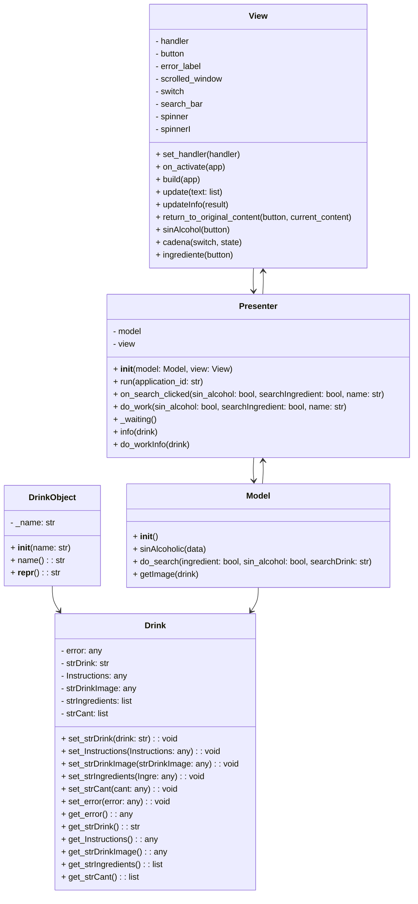
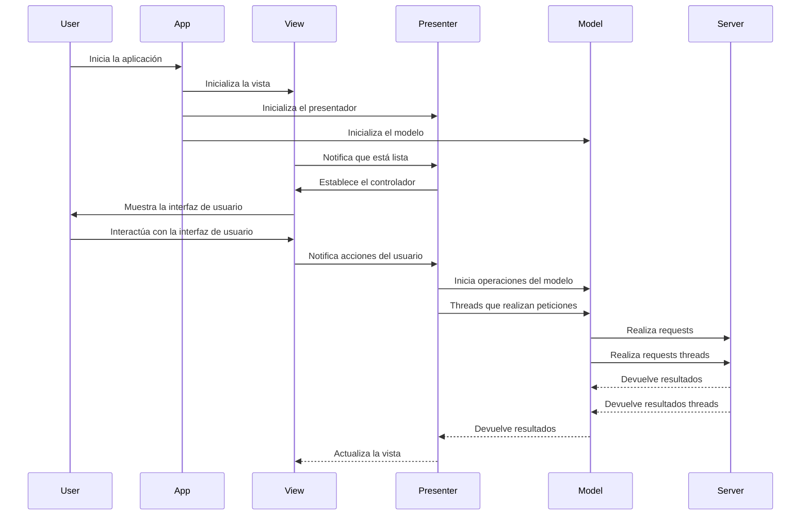
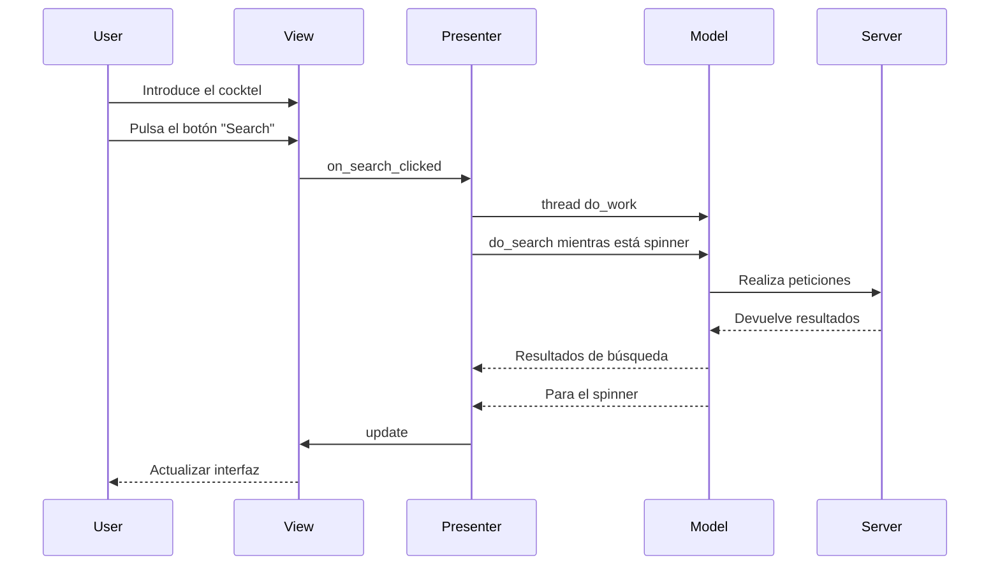
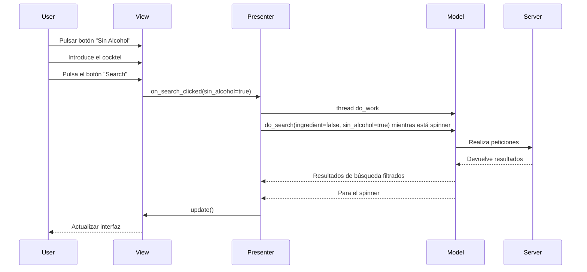
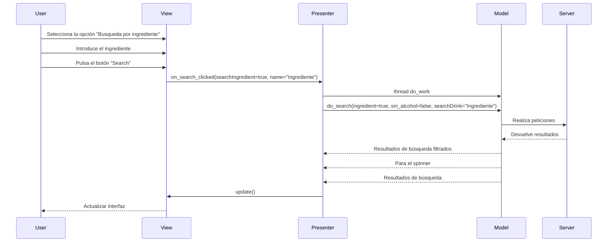

# Diseño software

## Diagrama de Clases

## Inicio de la aplicación

## Caso de Uso 1: Búsqueda de un cocktel

## Caso de Uso 2: Filtrar la búsqueda en función de con o sin alcohol

## Caso de uso 3: Búsqueda de cockteles por ingrediente

